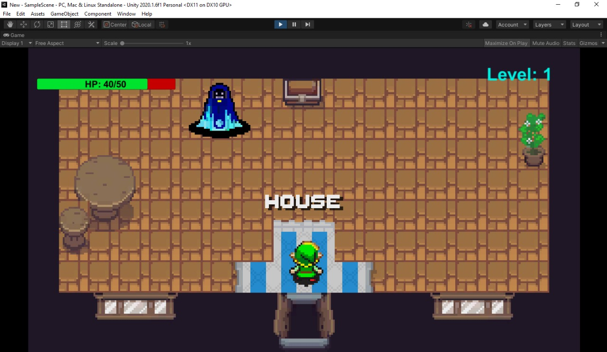

<h1 align="center">Unity_Game_Project</h1>

<h3 align="center"> 
	🚧  Unity_Game_Project is under development 🚧
</h3>

 

>## 📖 About

My first top-down RPG game, being built with C# and Unity. This project has only experimental and didactic proposal having been developed so far as part of my desire to learn more about how games are developed in practice using Unity, for this reason some of the resources that have been used, such as certain sprites, were not created by me.

 

>## 🕹 Game Layout 

 

 

>## 📋 Prerequisites

To gain access to the project and be able to run or modify it you will need to have installed the following tools on your local machine:

- [Unity](https://unity.com/)

  

>## 🛠 Technologies and Tools

 

 

>## Author

Made with ☕ by <a href="https://br.linkedin.com/in/thiago-santos-6b6624182" >Thiago Santos.</a>

